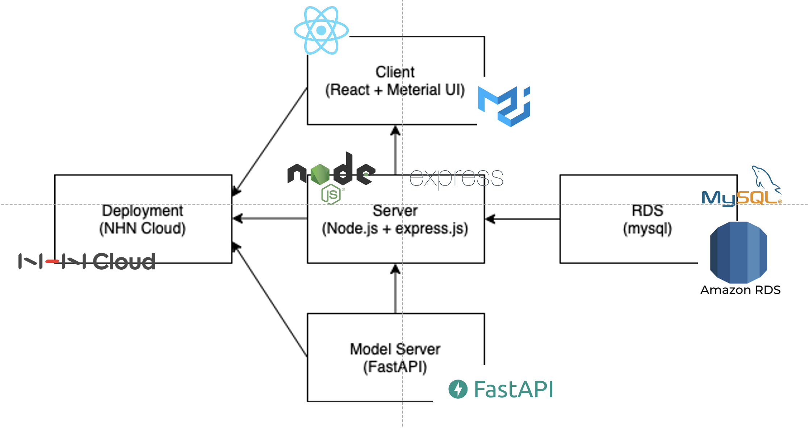
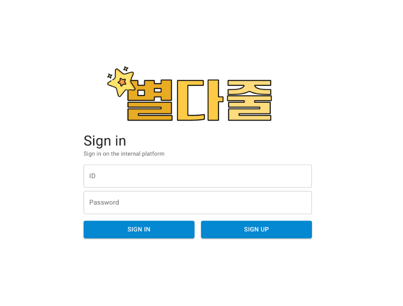
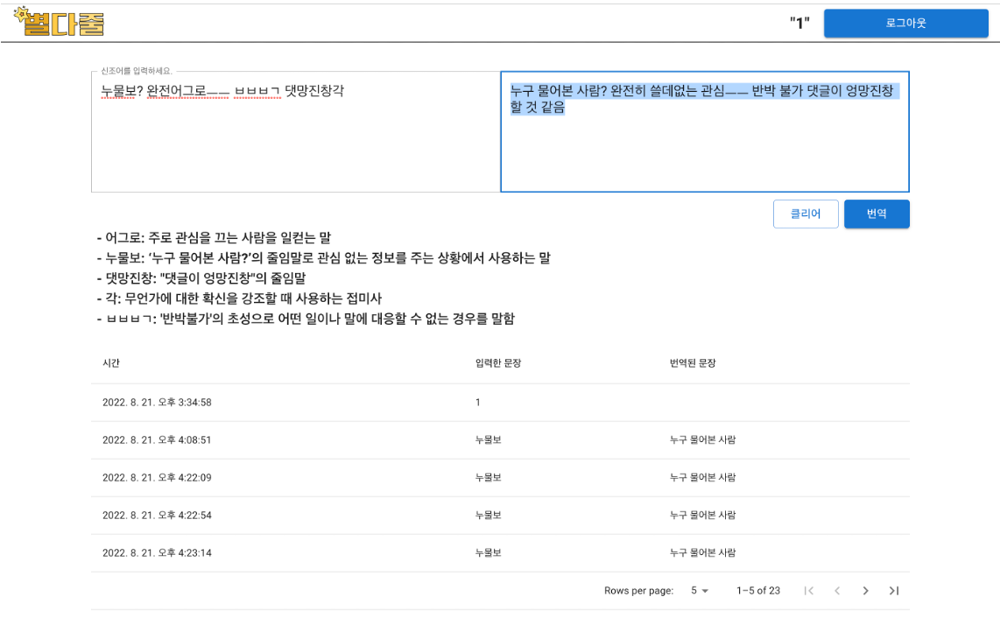

# 별다줄

한국어 신조어 번역 서비스 <b>별다줄</b>은 2022년 8월 21일 진행된 건국대학교 공과대학 동아리 <b>비빔밥 해커톤</b>(bimkerton)을 통해 구현된 서비스입니다.\
스마트폰 사용 연령층이 점점 넓어짐에 따라, 무분별한 신조어 및 인터넷 용어 사용은 중노년층의 넷상 문해력 저하를 야기하고 있습니다.\
문장 속에 존재하는 신조어를 파악하여 이해 가능한 문장으로 번역해주고, 해당하는 신조어에 대한 설명을 제공하는 것이 저희 서비스의 핵심 기능입니다.

<a href="https://www.youtube.com/watch?v=5WGzEVgfMSQ">발표 영상</a>

# Contents
* [별다줄](#별다줄)
  * [Project Architecture](#project-architecture)
  * [How to install](#how-to-install)
    * [Install node modules](#install-node-modules)
    * [Install python packages](#install-python-packages)
    * [Get model checkpoint file](#get-model-checkpoint-file-for-load)
  * [Getting Started](#getting-started)
    * [Run front-end](#run-front-end)
    * [Run node.js server](#run-node.js-server)
    * [Run python server](#run-python-server)
  * [Demo](#demo)
  * [Reference](#reference)
    * [Data](#data)

# Project Architecture



# How to install

## Install node modules
```
cd frontend
npm install

cd ../server
npm install
```

## Install python packages
```
cd py-server/assets
pip install -r requirements.txt
```

# Getting started

## Run front-end
```
cd frontend
npm start
```

## Run node.js server
```
python py-server/client.py
```

### Run python server
```
python py-server/client.py
```

# Demo
<table>
  <tr>
     <td></td>
     <td></td>
  </tr>
</table>

# Reference

1. [네이버 오픈사전PRO 신조어사전](https://open-pro.dict.naver.com/_ivo/dictmain?dictID=enegdwdxdyebegdxdwdsqyofgwrzrzuc)
